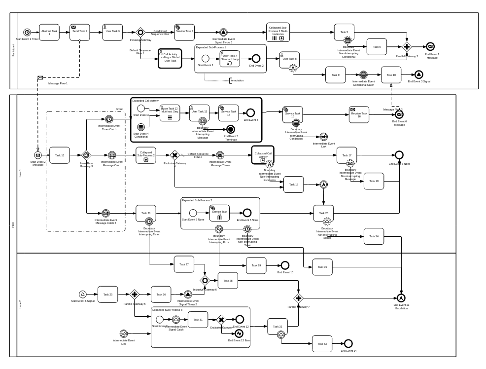

<h1 align="center">BPMN Visualization Examples</h1>  

    

         
    

    

         
         
         
    

This repository contains examples showing how to use [bpmn-visualization](https://github.com/process-analytics/bpmn-visualization-js).

## 🎮 Live Environment

Give a try to the [__⏩ live environment__](https://cdn.statically.io/gh/process-analytics/bpmn-visualization-examples/master/examples/index.html)
to quickly have an overview of the `bpmn-visualization` capabilities.

You will find both
- a `demo` that shows several features of `bpmn-visualization` at the same time. The sources of the demo are available in the
[bpmn-visualization](https://github.com/process-analytics/bpmn-visualization-js) repository.
- the examples described in more details below in this page. They demonstrate how to use a single feature.

## 🔭 Examples

### Running examples locally

Some examples may load ES Modules; in that case, you cannot open html pages directly from your local disk.

For instance, on Chrome, the Console would display the following errors 
> Access to script at 'file:///...../bpmn-visualization-examples/examples/my-file.js' from origin 'null' has been
> blocked by CORS policy: Cross origin requests are only supported for protocol schemes: http, data, chrome,
> chrome-extension, https. index.html:1  
> Failed to load resource: net::ERR_FAILED utils.js:1

To access such examples, you need to run a local web server and then access the examples via the http protocol.
We advise to make the local web server serve the whole repository, to also be able to access to the demo (resources available
in the `./demo` folder). 

Go to the repository root and use one the following solutions 
- python2: `python -m SimpleHTTPServer 8001` and go to http://localhost:8001/examples/ 
- python3: `python3 -m http.server 8002` and go to http://localhost:8002/examples/ 
- nodejs/npm: `npx http-server --port 8003  -o ./examples` and your default web browser opens http://localhost:8003/examples/ 
- .... your own lovely web server

### `bpmn-visualization` usage in browsers 

### Basic examples

Display BPMN Diagram:
- [Getting started](examples/display-bpmn-diagram/01-getting-started/README.md) - the simplest way to integrate `bpmn-visualization` in an HTML page
- [Load local BPMN diagrams](examples/display-bpmn-diagram/load-local-bpmn-diagrams/README.md) - load BPMN diagrams stored on your local device
- [Load remote BPMN diagrams](examples/display-bpmn-diagram/load-remote-bpmn-diagrams/README.md) - load BPMN diagrams from the [bpmn-miwg-test-suite GitHub repository](https://github.com/bpmn-miwg/bpmn-miwg-test-suite)

### Diagram navigation examples

- [BPMN Diagram navigation](examples/diagram-navigation/diagram-navigation/README.md) - use the mouse to zoom and move the diagram 
- [BPMN Diagram fit on load](examples/diagram-navigation/diagram-fit-on-load/README.md) - fit the BPMN diagram in the container on load
- [BPMN Diagram fit after load](examples/diagram-navigation/diagram-fit-after-load/README.md) - fit the BPMN diagram in the container after load

### Custom BPMN Theme examples

**DISCLAIMER: extension points are currently very experimental and are subject to changes.**  
They are mainly hacks to let you see what will be later available in a more integrated way. \
Custom BPMN Theme features will be progressively added to `bpmn-visualization`. See the [`Extensions` Milestone](https://github.com/process-analytics/bpmn-visualization-js/milestone/13).

- [Custom user task icon](examples/custom-bpmn-theme/custom-user-task-icon/README.md) - use your own icon
- [Custom colors](examples/custom-bpmn-theme/custom-colors/README.md) - custom defaults, specific to BPMN element types
- [Custom fonts](examples/custom-bpmn-theme/custom-fonts/README.md) - custom defaults, specific to BPMN element types
- [Hacktoberfest themes](examples/custom-bpmn-theme/hacktoberfest-diagram/README.md) - special Hacktoberfest diagram with Hacktoberfest colors

### Custom navigation examples

- [Open a call activity from a main BPMN Diagram on a modal](examples/custom-navigation/call-activity-with-modal-on-mouse-over/README.md) - interact with a diagram to open the details of a Call Activity on a modal
- [Open a call activity from a main BPMN Diagram on a tab (of the page)](examples/custom-navigation/call-activity-with-tabs-on-click/README.md) - interact with a diagram to open the details of a Call Activity in a tab (of the page)
- [Open a call activity from a main BPMN Diagram on the same container](examples/custom-navigation/call-activity-with-reload-on-dblclick/README.md) - interact with a diagram to load the details of a Call Activity in the same container

### Custom animation examples

- [Running Dashed Message Flow](examples/custom-animation/running-dashed-message-flow/README.md) - add custom running dashed animation on a Message Flow

### Miscellaneous examples

- [Compare `bpmn-visualization` with `bpmn-js`](./examples/misc/compare-with-bpmn-js/README.md) - compare the libraries on BPMN elements rendering, navigation and API usage

### `bpmn-visualization` usage in projects

- [Typescript + rollup](examples/projects/typescript-vanilla-with-rollup/README.md) - integration in a Vanilla Typescript rollup project

## 🔧 Contributing

To contribute to `bpmn-visualization-examples`, fork and clone this repository locally and commit your code on a separate branch. \
Please add a screenshot of the new rendering when you open a pull-request.

You can find more detail in our [Contributing guide](CONTRIBUTING.md). Participation in this open source project is subject to a [Code of Conduct](https://github.com/process-analytics/.github/blob/main/CODE_OF_CONDUCT.md).

:sparkles: A BIG thanks to all our contributors :slightly_smiling_face:

## 📃 License

`bpmn-visualization-examples` is released under the [Apache 2.0](LICENSE) license. \
Copyright &copy; 2020, Bonitasoft S.A.

## ⚡ Powered by

**[statically.io](https://statically.io)** (<kbd>demo</kbd> and <kbd>examples</kbd> live environments)
