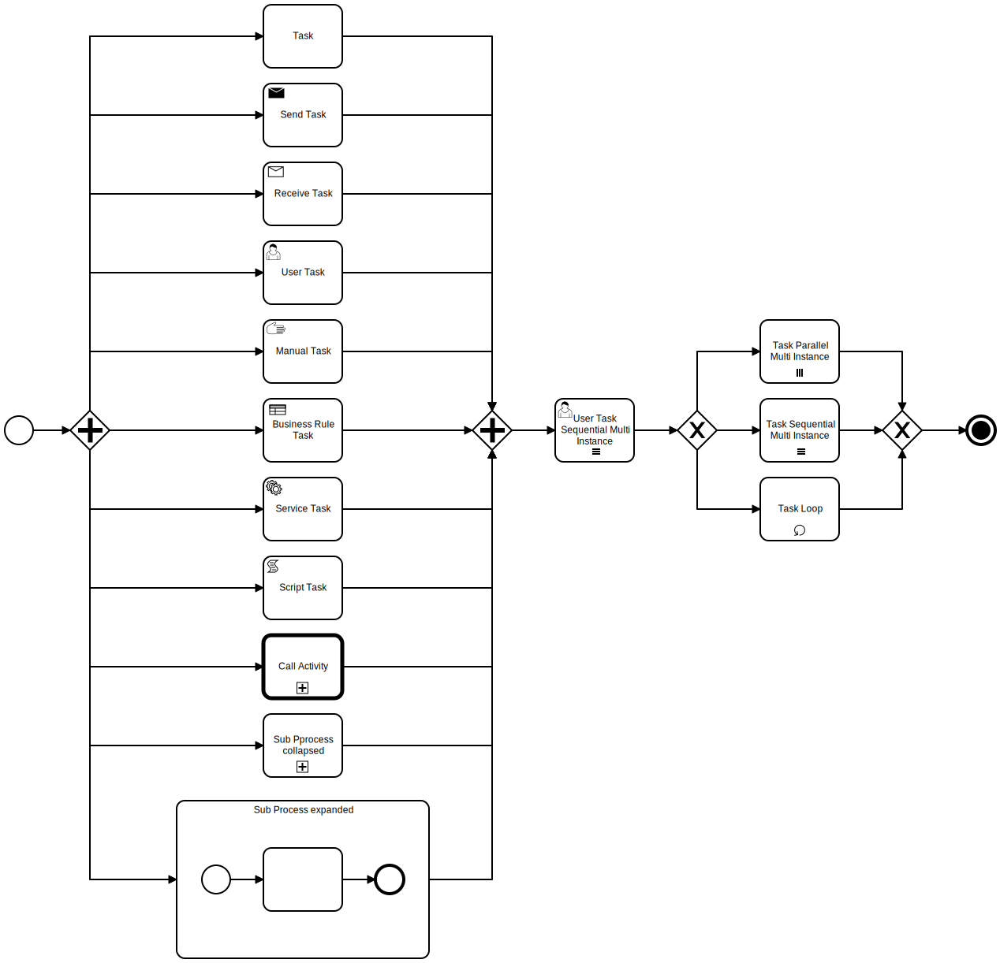
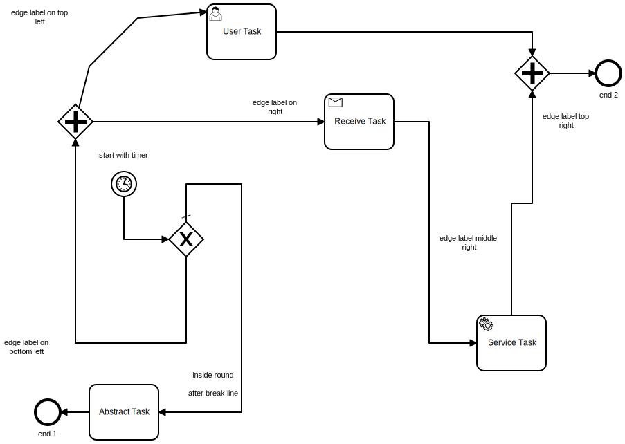

# BPMN Diagram examples to test `bpmn-visualization` rendering

Here is a list of BPMN files to demonstrate the detection and rendering capabilities of `bpmn-visualization`

Each BPMN file has a image (SVG or PNG) companion file to let you get an overview of the expected rendering. Notice that
the image may not be up to date with the BPMN file, so the final display may differ a little.  

Feel free to create a PR to update the image if the discrepancies are too large.

[Events](all_event_types.bpmn)

[Gateways](all_gateway_types.bpmn)

[Sequence flows](all_sequence_flow_types.bpmn)

[Tasks](all_task_types.bpmn)

## Labels

[Edge Labels](label_edges.bpmn)

