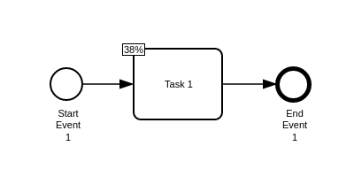

# Integrate `bpmn-visualization` in a vanilla webpack JavaScript project

## Usage

To run locally:

1. `npm install`
2. `npm run serve`
3. [localhost app](http://localhost:8080)

You will see the following diagram:



The code calling `bpmn-visualization` to render the BPMN diagram is available in [index.js](src/index.js).
Any code changes is quickly made available in the browser.


## WARNING about the webpack configuration

Make sure you have defined the `mainFields` in the configuration, otherwise, `bpmn-visualization` doesn't load correctly.
In this project, this is configured in [webpack.config.js](./webpack.config.js).

```json
    resolve:{
        mainFields: ['module', 'main'],
    },
```

See the [webpack 'resolve main fields' documentation](https://webpack.js.org/configuration/resolve/#resolvemainfields) for more details.
