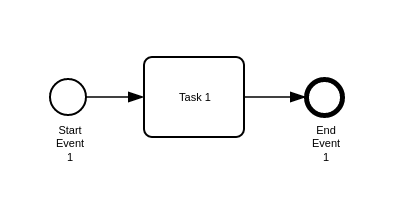

# Integrate `bpmn-visualization` in a vanilla rollup TypeScript 

To run locally:

1. `npm install`
2. `npm run start`
3. [localhost app](http://localhost:10001)

You should see a BPMN diagram displayed in the page

The code calling `bpmn-visualization` to render the BPMN diagram is available in [initialize.ts](src/app/initialize.ts).

If you want to play with the code, run `npm run watch` (instead of `npm run start`) to make any changes in the code or
assets available in the browser.
