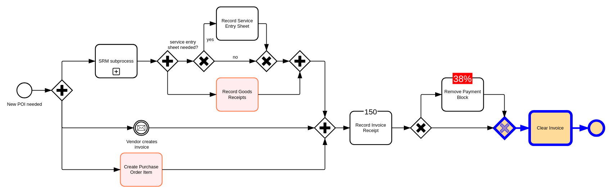

# Integrate `bpmn-visualization` in a vanilla JavaScript project built with Webpack

## Usage

To run locally:

1. `npm install`
2. `npm run serve`
3. [localhost app](http://localhost:8080)

You will see the following diagram:

The code calling `bpmn-visualization` to render the BPMN diagram is available in [index.js](src/index.js).
Any code changes is quickly made available in the browser.

## WARNING about the Webpack configuration for old `bpmn-visualization` versions

When using bpmn-visualization@0.26.1 or older, a special configuration is required. This no more needed starting from version 0.26.2 (see [PR 384](https://github.com/process-analytics/bpmn-visualization-examples/pull/384) for more explanations).

To know how to configure Webpack for such versions, see the [README of the 0.26.1 examples](https://github.com/process-analytics/bpmn-visualization-examples/blob/v0.26.1/projects/javascript-vanilla-with-webpack/README.md) for more details.
