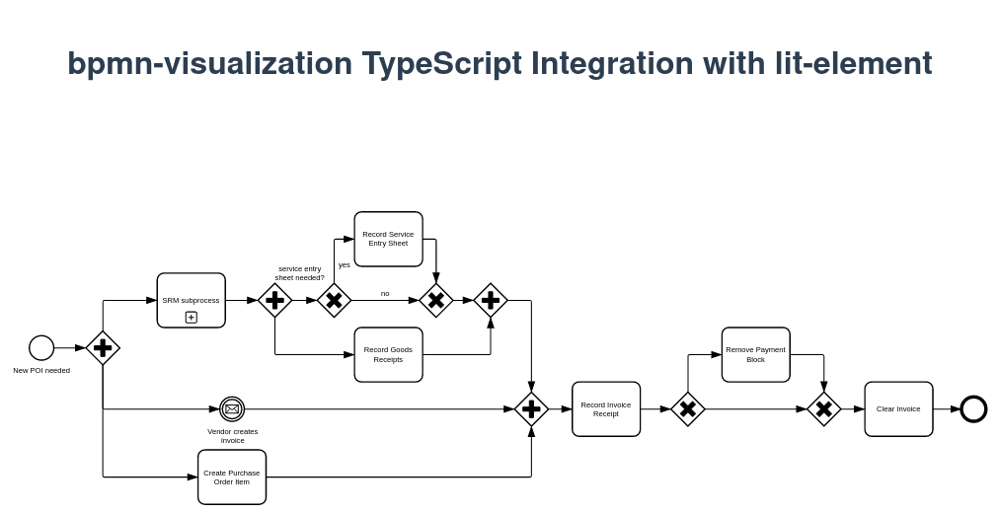

# Integrate `bpmn-visualization` in a lit-element TypeScript project built with Vite

To run locally:

1. `npm install`
2. `npm start`
3. [localhost app](http://localhost:5173)

You will see the following diagram:

The code calling `bpmn-visualization` to render the BPMN diagram is available in [index.ts](src/index.ts).

If you want to bundle the application, run `npm run build` and then run `npm run preview` to access to a preview of the
bundle application with http://localhost:4173.

## Specific mxGraph patch to make it work 

To workaround bug [#2738](https://github.com/process-analytics/bpmn-visualization-js/issues/2738) "[BUG] Failed to execute 'getComputedStyle' when using lit",
`mxGraph` is patched using [patch-package](https://www.npmjs.com/package/patch-package) as the root cause of the bug is an issue in the `mxGraph` code.

The patch has been created by modifying manually `node_modules/mxgraph/javascript/dist/build.js`
and then running: `npx patch-package mxgraph`
