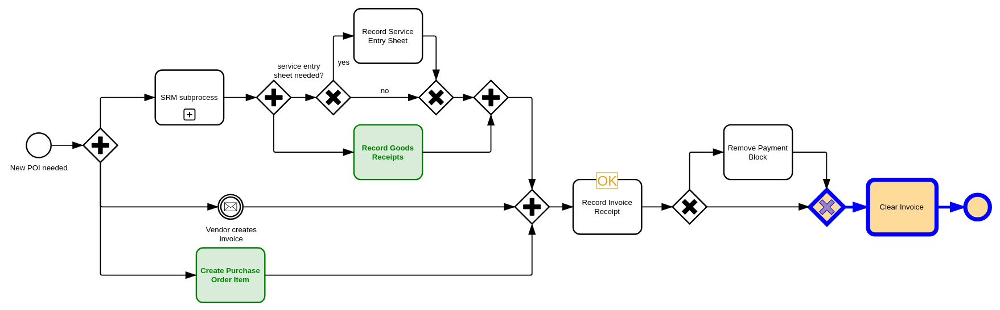

# Integrate `bpmn-visualization` in a vanilla TypeScript project build with Parcel

Parcel v2 is used in this project: https://parceljs.org

To run locally:

1. `npm install`
2. `npm start`
3. [localhost app](http://localhost:1234)

You will see the following diagram:

The code calling `bpmn-visualization` to render the BPMN diagram is available in [index.ts](src/index.ts).

If you want to bundle the application, run `npm run build`.
