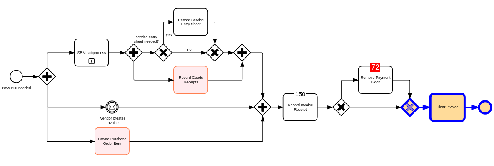

# Rsbuild Project

A vanilla TypeScript project built with https://rsbuild.dev

Initialized by following https://rsbuild.dev/guide/start/quick-start:
- `npm create rsbuild@latest`
- this used create-rsbuild@1.0.1-rc.5

To run locally:

1. `npm install`
2. `npm start`
3. [localhost app](http://localhost:3000)

You will see the following diagram:

The code calling `bpmn-visualization` to render the BPMN diagram is available in [index.ts](src/index.ts).

If you want to bundle the application, run `npm run build` and then run `npm run preview` to access to a preview of the
bundle application with http://localhost:3000.
