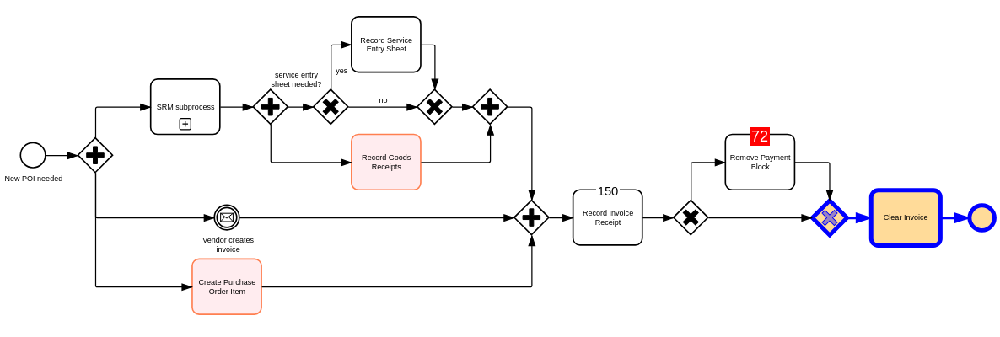

# Integrate `bpmn-visualization` in a vanilla TypeScript project built with Vite

Created with https://vite.new/vanilla-ts.

To run locally:

1. `npm install`
2. `npm start`
3. [localhost app](http://localhost:5173)

You will see the following diagram:

The code calling `bpmn-visualization` to render the BPMN diagram is available in [index.ts](src/index.ts).

If you want to bundle the application, run `npm run build` and then run `npm run preview` to access to a preview of the
bundle application with http://localhost:4173.
